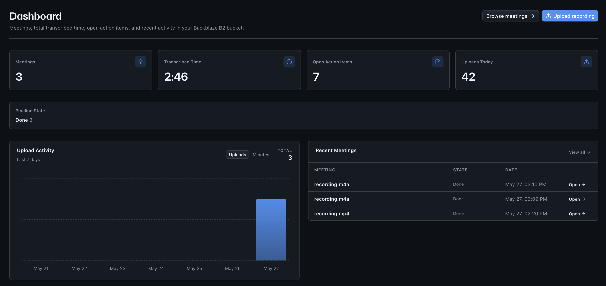
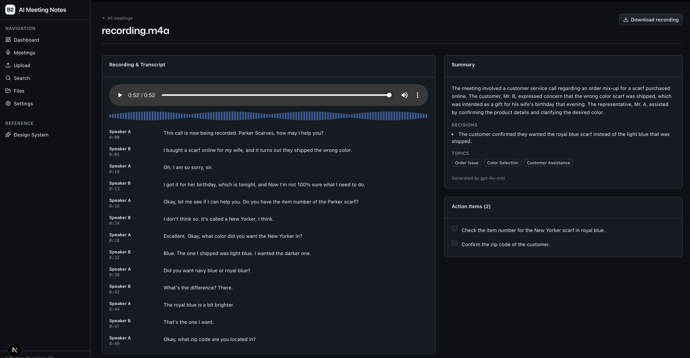
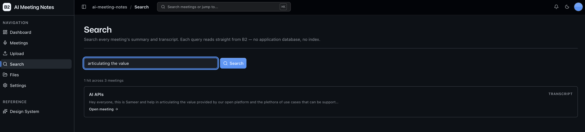

<!-- last_verified: 2026-05-27 -->
# AI Meeting Notes

Upload a meeting recording. Get a searchable meeting memory: synced playback, diarized transcript, structured summary, decisions, action items, and cross-meeting search — with every durable artifact stored on **[Backblaze B2](https://www.backblaze.com/sign-up/ai-cloud-storage?utm_source=github&utm_medium=referral&utm_campaign=ai_artifacts&utm_content=b2ai-ai-meeting-notes)** via the S3-compatible API.

This is a **working reference architecture** for teams building AI meeting intelligence on object storage. B2 is the system of record: each meeting lands under one prefix containing the original recording, pipeline status, transcript, summary, and actions. The backend runs AssemblyAI diarized speech-to-text, then an LLM (OpenAI by default, Anthropic Claude as an opt-in alternative) extracts the summary and action-item list. Search reads live from B2, so the demo stresses the product shape that matters: **durable meeting history with storage-native replay and heavy read traffic**.

**Use it like this:**

- Drop a meeting recording into `/upload`.
- Watch the pipeline move from queued to transcribing to summarizing to done.
- Open `/meetings/<id>` for a synced player, click-to-seek transcript, summary, decisions, and action-item checklist.
- Search across every meeting's transcript and summary from `/search`.
- Browse the underlying B2 objects from `/files` when you want the operational view.

**What you get:**

- `/` — Dashboard with meetings count, total transcribed minutes, open action items, pipeline-state breakdown, and recent meetings.
- `/meetings` — searchable library of meeting cards with title, date, pipeline state, and summary excerpt.
- `/meetings/<id>` — durable meeting memory: playback, transcript, summary, decisions, actions, and live pipeline status.
- `/upload` — drag-and-drop recording upload that writes to B2 and starts the transcription pipeline.
- `/search` — cross-meeting substring search over summaries and transcripts, pulled live from B2.
- `/files` — full B2 bucket explorer for ops-style browsing, preview, download, and delete.
- `/design` — design system showcase including the **Meeting Card** primitive.

## What It Looks Like

### Dashboard



### Meeting Playback



### Search



## Quick Start

You need: Node.js >= 20, pnpm >= 9, Python >= 3.11, and a free **[Backblaze B2 account](https://www.backblaze.com/sign-up/ai-cloud-storage?utm_source=github&utm_medium=referral&utm_campaign=ai_artifacts&utm_content=b2ai-ai-meeting-notes)**. You'll also need an [**AssemblyAI** API key](https://www.assemblyai.com/app/account) for transcription and an [**OpenAI** API key](https://platform.openai.com/api-keys) for summary + action-item extraction (Anthropic Claude is available as an opt-in alternative).

**1. Clone and install**

```bash
git clone https://github.com/backblaze-b2-samples/ai-meeting-notes.git
cd ai-meeting-notes
pnpm install
```

**2. Set up the backend**

```bash
cd services/api
python -m venv .venv && source .venv/bin/activate
pip install -r requirements.txt
cd ../..
```

**3. Configure environment**

```bash
cp .env.example .env
```

Open `.env` in your editor. Then head to the [Backblaze B2 dashboard](https://secure.backblaze.com/b2_buckets.htm?utm_source=github&utm_medium=referral&utm_campaign=ai_artifacts&utm_content=b2ai-ai-meeting-notes) and:

1. **Create a bucket.** B2 will show three values — paste each into `.env`:
   - **Bucket Unique Name** -> `B2_BUCKET_NAME`
   - **Endpoint** -> `B2_ENDPOINT`
   - **Region** (the path segment of the endpoint, e.g. `us-west-004`) -> `B2_REGION`
2. **Create an application key** with `Read and Write` permission. Paste into `.env`:
   - **keyID** -> `B2_KEY_ID`
   - **applicationKey** -> `B2_APPLICATION_KEY` *(only shown once — paste it now)*
3. **Add your transcription + LLM keys** to `.env`:
   - `ASSEMBLYAI_API_KEY` for transcription (<https://www.assemblyai.com/app/account>)
   - `OPENAI_API_KEY` for summary + action-item extraction (<https://platform.openai.com/api-keys>)
   - To use Anthropic Claude instead, uncomment the Anthropic block in `.env` and provide `ANTHROPIC_API_KEY` (<https://console.anthropic.com/>)

> Walkthrough? See [creating a bucket](https://www.backblaze.com/docs/cloud-storage-create-and-manage-buckets?utm_source=github&utm_medium=referral&utm_campaign=ai_artifacts&utm_content=b2ai-ai-meeting-notes) and [creating app keys](https://www.backblaze.com/docs/cloud-storage-create-and-manage-app-keys?utm_source=github&utm_medium=referral&utm_campaign=ai_artifacts&utm_content=b2ai-ai-meeting-notes).

**4. Run it**

```bash
pnpm dev
```

Frontend at `localhost:3000`, API at `localhost:8000`. Drop a meeting recording in `/upload` and watch the pipeline run end-to-end on `/meetings/<id>`.

`pnpm dev` runs `pnpm doctor` first — a preflight check that catches the common setup gotchas (wrong Node/Python version, missing venv, missing or placeholder `.env`, ports already taken, missing provider keys) and tells you exactly how to fix each one. Run it standalone any time with `pnpm doctor`.

## B2 layout

Every meeting lands under a single per-meeting prefix:

```
meetings/<meeting-id>/
  recording.<ext>     original upload (audio or video)
  status.json         {state, stages, error?, updated_at}
  transcript.json     {segments, speakers, language, duration_ms, provider}
  summary.json        {summary, decisions, topics, model}
  actions.json        {items: [{text, owner?, due?, status, source_segment_ids}]}
```

`status.json` is written first (state=`queued`) so a UI poll right after upload always finds *something*. Each pipeline stage rewrites `status.json` before producing its artifact, so the UI can show progress without reading the large transcript every poll.

## Core Features

- [Meeting Upload](docs/features/meeting-upload.md) — drag-and-drop a recording (audio or video); the recording is written to B2 before the response returns and the transcription pipeline kicks off as a background task.
- [Meetings Library](docs/features/meetings-library.md) — `/meetings` grid scoped to the `meetings/` prefix in B2; one card per recording with title, state, and summary excerpt.
- [Meeting Playback](docs/features/meeting-playback.md) — synced player with click-to-seek transcript and current-segment highlight.
- [Summary & Action Items](docs/features/summary-action-items.md) — an LLM (OpenAI by default, Anthropic Claude optional) produces a structured summary, decisions list, and action items per meeting; every artifact is stored alongside the recording in B2.
- [Cross-Meeting Search](docs/features/cross-meeting-search.md) — query across every meeting's summary and transcript; v1 is exact substring with snippets, v2 path documented for embedding-based search.
- [Pipeline Status](docs/features/pipeline-status.md) — async pipeline state visible per meeting (queued / transcribing / summarizing / done / failed) powered by `status.json` polls.
- [Bucket Explorer](docs/features/file-browser.md) — full B2 bucket tree view for ops-level browsing of every object, including the per-meeting bundles.
- [Dashboard](docs/features/dashboard.md) — meetings, total transcribed minutes, open action items, recent activity chart, recent meetings table.
- [Design System](docs/design-system.md) — tokens, primitives, AI elements, the blaze generating loader, the `MeetingCard` primitive, and inline `ErrorState` / `EmptyState` patterns. Live preview at `/design`.

Cross-cutting essentials:

- Inline error handling — fetch failures surface *what's wrong* (API offline, 401, 5xx) and offer a Retry.
- Single-source config — one `.env` at the repo root powers both API and web, validated at startup.
- Centralized data layer — every fetch flows through TanStack Query hooks in `apps/web/src/lib/queries.ts`.
- Structural tests — verify layering rules, import boundaries, SDK containment, file size limits.
- Structured JSON logging — every request traced with `request_id` and timing.
- `/health` endpoint — B2 connectivity check.
- `/metrics` endpoint — Prometheus-format counters (request count, latency, uploads).

## Tech Stack

- TypeScript, Next.js 16, React 19, Tailwind v4, shadcn/ui, Recharts
- TanStack Query — caching, dedup, retry, stale-while-revalidate for every fetch; polls `status.json` while a pipeline is in flight
- Python 3.11+, FastAPI, boto3, Pydantic v2
- AssemblyAI (transcription with diarization)
- OpenAI (default) or Anthropic Claude (alternative) for summary + action-item extraction — structured output via JSON-schema / tool-use
- Backblaze B2 (S3-compatible object storage)
- pnpm workspaces (monorepo)

## Commands

| Command | What it does |
|---------|-------------|
| `pnpm dev` | Start frontend + backend |
| `pnpm dev:web` | Frontend only |
| `pnpm dev:api` | Backend only |
| `pnpm build` | Build frontend |
| `pnpm lint` | Lint frontend |
| `pnpm lint:api` | Lint backend (ruff) |
| `pnpm test:api` | Run backend tests |
| `pnpm check:structure` | Verify layering rules |
| `pnpm test:e2e` | Playwright e2e tests (run `pnpm --filter @ai-meeting-notes/web exec playwright install chromium` once first) |

## For coding agents

[AGENTS.md](AGENTS.md) is the entry point — repository map, architectural invariants, commands, and conventions in one place. Layering rules (`types -> config -> repo -> service -> runtime`) and SDK containment (`boto3`, `assemblyai`, `openai`, `anthropic` only in `repo/`) are enforced mechanically by structural tests, not by convention. See [ARCHITECTURE.md](ARCHITECTURE.md) for the wider system view.

## Documentation

| Doc | Purpose |
|-----|---------|
| [AGENTS.md](AGENTS.md) | Agent entry point — repo layout, invariants, commands |
| [ARCHITECTURE.md](ARCHITECTURE.md) | System layout, layering, data flows |
| [docs/features/](docs/features/) | Per-feature docs |
| [docs/app-workflows.md](docs/app-workflows.md) | User journeys |
| [docs/dev-workflows.md](docs/dev-workflows.md) | Engineering workflows and testing |
| [docs/SECURITY.md](docs/SECURITY.md) | B2 + provider credentials |
| [docs/RELIABILITY.md](docs/RELIABILITY.md) | Pipeline failure modes, retry |
| [docs/exec-plans/](docs/exec-plans/) | Execution plans and tech debt tracker |

## License

MIT License — see [LICENSE](LICENSE) for details.

## Claude Agent B2 Skill

Manage Backblaze B2 from your terminal using natural language (list/search, audits, stale or large file detection, security checks, safe cleanup).

Repo: [https://github.com/backblaze-b2-samples/claude-skill-b2-cloud-storage](https://github.com/backblaze-b2-samples/claude-skill-b2-cloud-storage)
